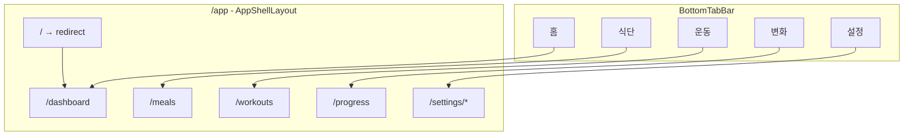

# 5탭 라우팅 확장 및 페이지 스켈레톤 생성

## 현재 상태

- **바텀탭**: 2개 (홈, 설정)
- **라우트**: `/app/dashboard`, `/app/settings/*`
- **목표**: 5개 탭으로 확장 (대시보드/식단/운동/진행/설정)

## 변경 파일

### 1. BottomTabBar 탭 확장

[`src/components/navigation/BottomTabBar.tsx`](src/components/navigation/BottomTabBar.tsx)

```tsx
// 현재: 2개 탭
const tabs = [
  { to: "/app/dashboard", icon: Home, label: "홈" },
  { to: "/app/settings", icon: Settings, label: "설정" },
];

// 변경: 5개 탭
const tabs = [
  { to: "/app/dashboard", icon: Home, label: "홈" },
  { to: "/app/meals", icon: Utensils, label: "식단" },
  { to: "/app/workouts", icon: Dumbbell, label: "운동" },
  { to: "/app/progress", icon: TrendingUp, label: "변화" },
  { to: "/app/settings", icon: Settings, label: "설정" },
];
```

- lucide-react 아이콘 추가: `Utensils`, `Dumbbell`, `TrendingUp`

### 2. App.tsx 라우트 추가

[`src/App.tsx`](src/App.tsx)

```tsx
// 추가할 라우트 (dashboard와 settings 사이)
<Route path="meals" element={<MealsPage />} />
<Route path="workouts" element={<WorkoutsPage />} />
<Route path="progress" element={<ProgressPage />} />
```

- 3개 페이지 import 추가

### 3. 페이지 스켈레톤 생성 (3개)

모든 페이지는 IA의 공통 레이아웃 패턴을 따름:

- **상단**: 날짜/컨텍스트 + 요약
- **중단**: 리스트/콘텐츠 영역 (빈 상태)
- **하단/FAB**: 추가 액션

#### 3-1. [`src/pages/MealsPage.tsx`](src/pages/MealsPage.tsx) (신규)

```tsx
export function MealsPage() {
  return (
    <div className="p-4 space-y-4">
      {/* 상단: 날짜 + 요약 */}
      <header>
        <h1>식단</h1>
        <p>오늘 총 0 kcal</p>
      </header>
      {/* 중단: 식사 섹션 (빈 상태) */}
      <section>
        <p>기록된 음식이 없습니다.</p>
      </section>
      {/* 하단: 추가 버튼 */}
      <button>음식 추가</button>
    </div>
  );
}
```

#### 3-2. [`src/pages/WorkoutsPage.tsx`](src/pages/WorkoutsPage.tsx) (신규)

```tsx
export function WorkoutsPage() {
  return (
    <div className="p-4 space-y-4">
      {/* 상단: 날짜 + 요약 */}
      <header>
        <h1>운동</h1>
        <p>오늘 0세트</p>
      </header>
      {/* 중단: 운동 리스트 (빈 상태) */}
      <section>
        <p>기록된 운동이 없습니다.</p>
      </section>
      {/* 하단: 추가 버튼 */}
      <button>운동 추가</button>
    </div>
  );
}
```

#### 3-3. [`src/pages/ProgressPage.tsx`](src/pages/ProgressPage.tsx) (신규)

```tsx
export function ProgressPage() {
  return (
    <div className="p-4 space-y-4">
      {/* 상단: 기간/지표 선택 */}
      <header>
        <h1>변화</h1>
        <p>체중 추이</p>
      </header>
      {/* 중단: 그래프 영역 (플레이스홀더) */}
      <section>
        <p>기록된 데이터가 없습니다.</p>
      </section>
      {/* 하단: 기록 추가 버튼 */}
      <button>체중 기록</button>
    </div>
  );
}
```

## 라우팅 구조(결과)



## 완료 조건

- 바텀탭 5개가 모두 표시되고, 각 탭 클릭 시 해당 페이지로 이동
- 각 페이지가 빈 상태 UI와 추가 CTA를 표시
- 타입/린트 에러 없음