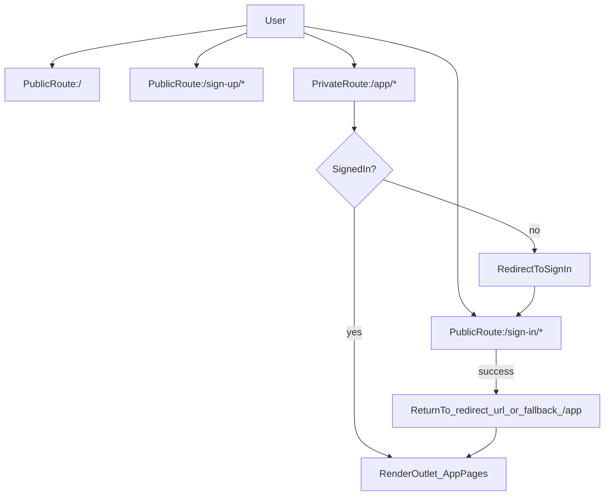

# Clerk + React Router(Declarative) 구현 플랜

## 목표

- **React Router(Declarative mode)**를 도입해 페이지 단위 라우팅을 구성
- **Clerk 로그인 연동**(권장: React Router 전용 SDK인 `@clerk/react-router` 사용)
- 라우팅 규칙: **`/`는 공개**, **`/app/*`는 로그인 필요(보호 라우트)**
- 인증 UI: **`/sign-in/*`, `/sign-up/*` 라우트에서 Clerk 컴포넌트 렌더링**

## 현재 상태(기준점)

- `src/main.tsx`에서 `@clerk/clerk-react`의 `ClerkProvider`만 존재하고 라우터는 없음:
```1:20:/Users/raon/Desktop/Development/weight-app/src/main.tsx
import { ClerkProvider } from "@clerk/clerk-react";
import { StrictMode } from "react";
import { createRoot } from "react-dom/client";

import "./index.css";
import App from "./App.tsx";

const PUBLISHABLE_KEY = import.meta.env.VITE_CLERK_PUBLISHABLE_KEY;

if (!PUBLISHABLE_KEY) {
  throw new Error("Missing Clerk Publishable Key");
}

createRoot(document.getElementById("root")!).render(
  <StrictMode>
    <ClerkProvider publishableKey={PUBLISHABLE_KEY} afterSignOutUrl="/">
      <App />
    </ClerkProvider>
  </StrictMode>
);
```

- `src/App.tsx`는 로그인 버튼/유저 버튼을 헤더에 노출하고 단일 화면을 렌더:
```1:29:/Users/raon/Desktop/Development/weight-app/src/App.tsx
import { ComponentExample } from "@/components/component-example";
import { ReloadPrompt } from "@/components/pwa/ReloadPrompt";
import {
  SignedIn,
  SignedOut,
  SignInButton,
  SignUpButton,
  UserButton,
} from "@clerk/clerk-react";

export function App() {
  return (
    <>
      <ReloadPrompt />
      <header style={{ display: "flex", gap: 12, alignItems: "center" }}>
        <SignedOut>
          <SignInButton />
          <SignUpButton />
        </SignedOut>
        <SignedIn>
          <UserButton />
        </SignedIn>
      </header>
      <ComponentExample />
    </>
  );
}

export default App;
```


## 권장 아키텍처(선택한 방향)

- React Router: **Declarative mode** (`BrowserRouter` + `Routes` + `Route`)
- Clerk: **`@clerk/react-router` 사용**
  - Clerk 공식 가이드에서 React Router 사용 시 전용 SDK 사용을 권장
  - `signInFallbackRedirectUrl`, `signUpFallbackRedirectUrl`로 로그인/회원가입 후 기본 복귀 경로를 `/app`로 설정
- 보호 라우트: **컴포넌트 가드 방식**
  - `SignedIn`이면 `<Outlet />`
  - `SignedOut`이면 `<RedirectToSignIn />`

## 라우트 설계

- **Public**
  - `/` : 랜딩(또는 기존 `ComponentExample`를 홈으로 노출)
  - `/sign-in/*` : `<SignIn />`
  - `/sign-up/*` : `<SignUp />`
- **Private**
  - `/app` : 앱 홈(예: 대시보드)
  - `/app/*` : 앱 내부 페이지들(예: 기록/설정)

## 구현 단계(파일 중심)

### 1) 의존성 추가

- `react-router`와 `@clerk/react-router`를 설치
  - Clerk 가이드의 Declarative mode 예시가 이 조합을 전제로 함

### 2) 라우터 엔트리 구성

- 신규 파일로 라우트 트리를 분리(예: `src/router.tsx`)
  - `App`를 “라우터 전체를 렌더하는 컴포넌트”로 바꾸거나, `App`를 “루트 레이아웃”으로 바꾸고 라우터는 별도 파일로 두는 방식 중 **유지보수 관점에서 라우터 분리**를 채택

### 3) `src/main.tsx` 수정

- `BrowserRouter`를 최상단에 두고, `ClerkProvider`는 **`@clerk/react-router`에서 import**로 교체
- `ClerkProvider`에 아래 redirect 기본값을 설정
  - `afterSignOutUrl="/"`
  - `signInFallbackRedirectUrl="/app"`
  - `signUpFallbackRedirectUrl="/app"`

### 4) 레이아웃/페이지 컴포넌트 분리

- 신규 파일(예시)
  - `src/layouts/RootLayout.tsx` : 공통 레이아웃(예: `ReloadPrompt`, 헤더)
  - `src/layouts/RequireAuth.tsx` : 보호 라우트 가드 (`SignedIn/SignedOut + RedirectToSignIn`)
  - `src/pages/LandingPage.tsx` : `/`
  - `src/pages/SignInPage.tsx` : `/sign-in/*`에서 `<SignIn />`
  - `src/pages/SignUpPage.tsx` : `/sign-up/*`에서 `<SignUp />`
  - `src/pages/AppHomePage.tsx` : `/app` (기존 `ComponentExample`를 여기로 옮기는 것이 자연스러움)

### 5) 기존 `src/App.tsx` 처리

- 현재 `App.tsx`는 “단일 화면 + 헤더” 역할이어서 라우팅 도입 후 역할을 재정의
  - 권장: `App.tsx`를 `RouterApp`(라우터 트리 렌더)로 전환하고, 기존 UI는 `RootLayout`/`AppHomePage`로 이동

### 6) 동작 확인 시나리오(수동)

- `GET /` : 공개 페이지 렌더
- `GET /app` (로그아웃 상태): 자동으로 **Sign In으로 리다이렉트**
- `GET /sign-in/*` : Clerk Sign In 화면
- 로그인 성공 후: `redirect_url`이 있으면 그곳으로, 없으면 **`/app`로 fallback**
- 로그아웃 후: `/`로 이동

## 라우팅/인증 흐름(다이어그램)



## 리스크/주의사항

- Clerk 공식 가이드에 따라 **React Router 사용 시 `@clerk/react-router` 채택**을 전제로 함
- Clerk 컴포넌트 라우트는 보통 **splat(`/*`)**을 붙여서 하위 단계 플로우를 수용
  - 예: `/sign-in/*`, `/sign-up/*`