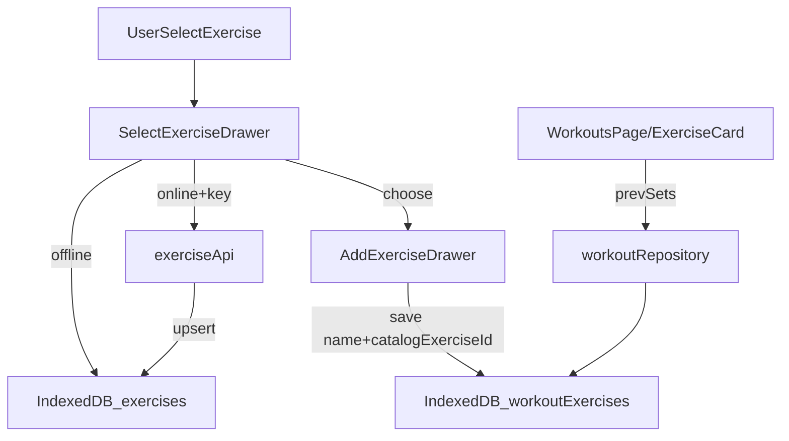

# ExerciseDB Remote-first + WorkoutExercise catalogId

## 목표
- **API 키가 있을 때(online)**: ExerciseDB API를 **우선 사용**해 운동 목록/검색이 seed 60개에 갇히지 않게 합니다.
- **오프라인/실패 시**: 기존 IndexedDB 캐시 + seed로 **정상 동작**합니다.
- **운동 기록**: `WorkoutExercise`에 **ExerciseDB의 id(=catalog id)**를 저장해, 이후 GIF/상세/자동완성/이전세트 매칭을 정확하게 만듭니다.

## 지금 상태에서 발견된 핵심 이슈
- `useExercises()`는 **캐시(=seed)가 1개라도 있으면 API를 거의 호출하지 않음** → API 키를 넣어도 데이터가 확장되지 않습니다. ([`/Users/raon/Desktop/Development/weight-app/src/features/exercises/queries.ts`](/Users/raon/Desktop/Development/weight-app/src/features/exercises/queries.ts))
- `SelectExerciseDrawer`의 **최근/즐겨찾기 탭은 `allExercises`에서 id로 다시 찾는 방식**이라, 캐시에 해당 id가 없으면 리스트가 비게 됩니다. ([`/Users/raon/Desktop/Development/weight-app/src/pages/workouts/SelectExerciseDrawer.tsx`](/Users/raon/Desktop/Development/weight-app/src/pages/workouts/SelectExerciseDrawer.tsx))
- 워크아웃 기록은 현재 `WorkoutExercise.name`만 저장하고, 이전 세트 조회도 name 기반이라 **ExerciseDB id 저장 방향과 연결이 끊겨 있음**. ([`/Users/raon/Desktop/Development/weight-app/src/domain/workouts/types.ts`](/Users/raon/Desktop/Development/weight-app/src/domain/workouts/types.ts), [`/Users/raon/Desktop/Development/weight-app/src/data/repositories/workoutRepository.ts`](/Users/raon/Desktop/Development/weight-app/src/data/repositories/workoutRepository.ts))

## 설계 요약(데이터 흐름)

## 실행 계획

### 1) ExerciseDB API 우선 사용(캐시 fallback)
- 수정: [`/Users/raon/Desktop/Development/weight-app/src/features/exercises/queries.ts`](/Users/raon/Desktop/Development/weight-app/src/features/exercises/queries.ts)
  - **필터가 있는 경우**(`search`/`target`/`bodyPart`/`equipment`)에는 `cached.length`와 무관하게 **API 호출을 우선 시도**
  - API 성공 시 결과를 `exerciseRepository.bulkUpsert()`로 저장 후 **API 결과를 반환**(UI 최신)
  - API 실패/오프라인이면 **캐시 반환**
  - **필터가 전혀 없는 경우**는 “전체 11k를 한번에” 같은 위험이 있으므로, 기본은 **캐시만 표시**하고 UI에서 “검색/필터를 유도”하도록 변경(2단계에서 UI 수정)
- 수정: [`/Users/raon/Desktop/Development/weight-app/src/data/api/exerciseApi.ts`](/Users/raon/Desktop/Development/weight-app/src/data/api/exerciseApi.ts)
  - RapidAPI ExerciseDB가 `limit/offset`을 실제로 지원하는지 확인 후, 미지원이면 파라미터 제거/대체
  - `429`(rate limit) 및 에러 바디를 파싱해 **의미 있는 에러 메시지**를 상위로 전달

### 2) SelectExerciseDrawer UX/성능 개선(디바운스 + 탭 데이터 소스 정리)
- 수정: [`/Users/raon/Desktop/Development/weight-app/src/pages/workouts/SelectExerciseDrawer.tsx`](/Users/raon/Desktop/Development/weight-app/src/pages/workouts/SelectExerciseDrawer.tsx)
  - 검색 입력은 **debounce(예: 300ms)** 또는 `useDeferredValue`로 API 호출 폭발 방지
  - “전체” 탭에서 검색어/필터가 없으면 리스트 대신 안내 문구: “검색하거나 인체도에서 부위를 선택하세요”
  - “최근/즐겨찾기”는 `allExercises.find()` 의존을 줄이고:
    - **캐시에서 id로 직접 조회**(`exerciseRepository.getById`)해 가능한 항목은 즉시 렌더
    - 캐시에 없는 항목은 `exerciseName` 기반의 **placeholder card**로 표시하고, online이면 `fetchExerciseById()`로 채워 넣기(캐시에 upsert)

### 3) 즐겨찾기/최근 데이터 일관성(선택/즐겨찾기 시 캐시 보장)
- 수정: [`/Users/raon/Desktop/Development/weight-app/src/pages/workouts/AddExerciseDrawer.tsx`](/Users/raon/Desktop/Development/weight-app/src/pages/workouts/AddExerciseDrawer.tsx)
  - 운동 선택 시 `exerciseRepository.bulkUpsert([exercise])`를 먼저 수행(해당 id가 항상 캐시에 존재)
- 수정: [`/Users/raon/Desktop/Development/weight-app/src/components/exercise-selector/ExerciseCard.tsx`](/Users/raon/Desktop/Development/weight-app/src/components/exercise-selector/ExerciseCard.tsx)
  - 즐겨찾기 토글 mutation에 **Exercise 객체(또는 최소 메타)**를 함께 넘겨, 토글 시에도 캐시가 보장되도록 처리
- 수정: [`/Users/raon/Desktop/Development/weight-app/src/features/exercises/mutations.ts`](/Users/raon/Desktop/Development/weight-app/src/features/exercises/mutations.ts)
  - `useToggleFavorite()`에서 (전달된) Exercise를 캐시에 upsert 후 favorite 기록 저장

### 4) WorkoutExercise에 catalog id 저장
- 수정: [`/Users/raon/Desktop/Development/weight-app/src/domain/workouts/types.ts`](/Users/raon/Desktop/Development/weight-app/src/domain/workouts/types.ts)
  - `WorkoutExercise`에 `catalogExerciseId?: string` 추가
  - `WorkoutExerciseInput`에 `catalogExerciseId?: string` 추가
  - 주의: `WorkoutSet.exerciseId`는 “워크아웃 내 exercise entry id”라서 이름 충돌 방지를 위해 **catalogExerciseId** 같은 별도 필드로 유지
- 수정: [`/Users/raon/Desktop/Development/weight-app/src/data/repositories/workoutRepository.ts`](/Users/raon/Desktop/Development/weight-app/src/data/repositories/workoutRepository.ts)
  - `addExercise()`에서 `catalogExerciseId`를 함께 저장
- 수정: [`/Users/raon/Desktop/Development/weight-app/src/pages/workouts/AddExerciseDrawer.tsx`](/Users/raon/Desktop/Development/weight-app/src/pages/workouts/AddExerciseDrawer.tsx)
  - 선택 추가 시 `{ name, catalogExerciseId: exercise.id }`로 저장
  - 직접 입력은 `catalogExerciseId` 없이 저장

### 5) 이전 세트 조회를 id 우선 + 이름 fallback으로 개선
- 수정: [`/Users/raon/Desktop/Development/weight-app/src/data/repositories/workoutRepository.ts`](/Users/raon/Desktop/Development/weight-app/src/data/repositories/workoutRepository.ts)
  - `getPreviousSetsForExercise(exerciseName, beforeDate)` → `getPreviousSetsForExercise({ catalogExerciseId?, exerciseName, beforeDate })` 형태로 변경
  - catalog id가 있으면 그것으로 과거 `workoutExercises`를 찾고, 없으면 name으로 fallback
- 수정: [`/Users/raon/Desktop/Development/weight-app/src/features/workouts/keys.ts`](/Users/raon/Desktop/Development/weight-app/src/features/workouts/keys.ts), [`/Users/raon/Desktop/Development/weight-app/src/features/workouts/queries.ts`](/Users/raon/Desktop/Development/weight-app/src/features/workouts/queries.ts)
  - query key에 `catalogExerciseId`를 포함해 캐시 충돌 방지
- 수정: [`/Users/raon/Desktop/Development/weight-app/src/pages/workouts/ExerciseCard.tsx`](/Users/raon/Desktop/Development/weight-app/src/pages/workouts/ExerciseCard.tsx)
  - 이전 세트 조회 호출 시 `exercise.name + (exercise.catalogExerciseId)`를 함께 전달

### 6) 검증(수동 QA 체크리스트)
- **온라인 + API 키**
  - 검색어 2글자 이상 입력 시 seed 외 데이터도 결과에 나타나고, 새 항목이 캐시에 저장되는지
  - 즐겨찾기/최근 탭이 캐시/placeholder를 통해 항상 렌더되는지
  - 429/네트워크 오류 시 UI가 깨지지 않고 안내되는지
- **오프라인**
  - seed 기반으로 운동 선택/기록이 가능하고 크래시가 없는지
- **워크아웃 기록**
  - 선택한 운동은 `catalogExerciseId`가 저장되고, 기존 수동 입력은 undefined로 유지되는지
  - 이전 세트(Prev) 표시가 기존 데이터와 호환되며, id가 있는 경우 더 정확히 매칭되는지

## 구현 Todos
- api-remote-first: `useExercises`를 remote-first로 변경 + 에러/429 처리
- drawer-debounce: `SelectExerciseDrawer` 검색 디바운스 + “전체” 탭 UX 조정
- recents-favorites-resolve: 최근/즐겨찾기 탭의 id→Exercise 해석 로직을 캐시/placeholder 기반으로 개선
- workout-catalog-id: `WorkoutExercise.catalogExerciseId` 추가 및 저장 경로 연결
- prevsets-by-id: 이전 세트 조회를 id 우선 + 이름 fallback으로 변경