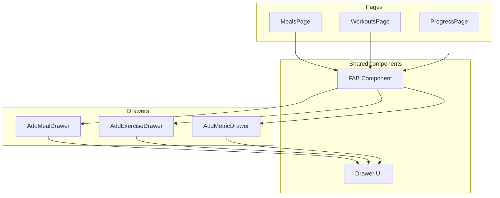
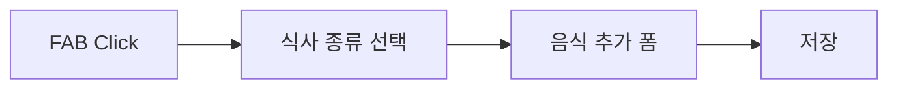

# FAB + Drawer 통합 구현 계획

## 아키텍처



## Phase 1: 공통 FAB 컴포넌트 생성

**파일**: `src/components/fab/FAB.tsx`

```tsx
interface FABProps {
  onClick: () => void;
  label: string;
  icon?: React.ReactNode;
}

export function FAB({ onClick, label, icon }: FABProps) {
  return (
    <button
      type="button"
      onClick={onClick}
      className="fixed bottom-20 right-4 z-40 flex size-14 items-center 
        justify-center rounded-2xl bg-primary text-primary-foreground 
        shadow-lg transition-all hover:scale-105 active:scale-95"
      aria-label={label}
    >
      {icon ?? <PlusIcon className="size-6" />}
    </button>
  );
}
```

## Phase 2: 변화 페이지 - Card 폼을 Drawer로 전환

**파일**: `src/pages/progress/AddMetricDrawer.tsx`

- 기존 `ProgressPage.tsx`의 인라인 Card 폼을 Drawer 컴포넌트로 분리
- FAB 클릭 시 Drawer 열기
- 기존 폼 로직(날짜, 값 입력) 유지

**변경사항**:

- `ProgressPage.tsx`에서 인라인 폼 제거
- `AddMetricDrawer` 컴포넌트 추가
- FAB → Drawer 연결

## Phase 3: 운동 페이지 - 기존 Drawer에 FAB 연결

**파일**: `src/pages/workouts/WorkoutsPage.tsx`, `src/pages/workouts/AddExerciseDrawer.tsx`

- 기존 `AddExerciseDrawer`의 트리거를 FAB로 교체
- Empty state 버튼은 유지 (기록 없을 때)
- FAB는 항상 표시

**변경사항**:

- `AddExerciseDrawer`에 controlled mode 지원 추가 (open, onOpenChange props)
- `WorkoutsPage`에서 FAB + Drawer 연결

## Phase 4: 식단 페이지 - 식사 선택 Drawer + 음식 추가 Drawer

**파일**: `src/pages/meals/AddMealDrawer.tsx`, `src/pages/meals/MealsPage.tsx`

**2단계 흐름**:

1. FAB 클릭 → 식사 종류 선택 Drawer (아침/점심/저녁/간식)
2. 식사 선택 → 음식 추가 Drawer



**변경사항**:

- `SelectMealDrawer` 컴포넌트 생성 (식사 종류 버튼 그리드)
- `AddFoodDrawer` 컴포넌트 생성 (기존 `AddFoodForm` 로직 재사용)
- 기존 `MealSection` 내 인라인 폼은 유지 (섹션별 추가 기능)

## 파일 구조 (최종)

```
src/components/
  fab/
    FAB.tsx                    # 공통 FAB 컴포넌트
    index.ts

src/pages/
  progress/
    AddMetricDrawer.tsx        # Phase 2: 새로 생성
  workouts/
    AddExerciseDrawer.tsx      # Phase 3: controlled mode 추가
  meals/
    SelectMealDrawer.tsx       # Phase 4: 새로 생성
    AddFoodDrawer.tsx          # Phase 4: 새로 생성
```

## 구현 순서

1. 공통 FAB 컴포넌트 생성
2. ProgressPage Drawer 전환 (가장 단순)
3. WorkoutsPage FAB 연결 (기존 Drawer 활용)
4. MealsPage 2단계 Drawer 구현 (가장 복잡)