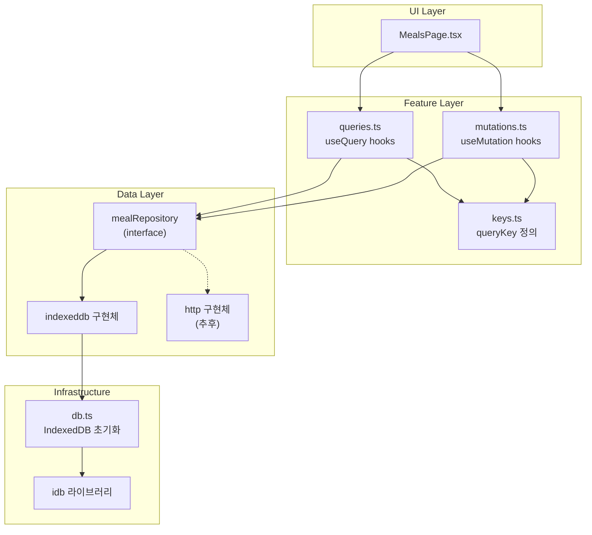

# IndexedDB Data Layer (Meals First)

## 아키텍처 개요



**핵심 원칙**: UI/Query 레이어는 `mealRepository` 인터페이스만 바라봄. 구현체(IndexedDB → HTTP)는 나중에 교체 가능.

---

## 1. 의존성 추가

`idb` 라이브러리 설치 (IndexedDB 래퍼, 스키마/인덱스 지원)

```bash
pnpm add idb
```

---

## 2. 도메인 타입 정의

**파일**: `src/domain/meals/types.ts`

`docs/user-flow.md` 기준 FoodEntry 스펙:

```typescript
export type MealType = "breakfast" | "lunch" | "dinner" | "snack";

export interface FoodEntry {
  id: string;           // nanoid or crypto.randomUUID
  date: string;         // ISO date string (YYYY-MM-DD)
  mealType: MealType;
  name: string;
  calories: number;
  protein?: number;
  carbs?: number;
  fat?: number;
  quantity?: number;
  createdAt: number;    // timestamp
  updatedAt: number;
}

export type FoodEntryInput = Omit<FoodEntry, "id" | "createdAt" | "updatedAt">;
```

---

## 3. IndexedDB 초기화

**파일**: `src/data/db.ts`

- `idb`의 `openDB`로 DB 생성
- object store: `foodEntries` (keyPath: `id`)
- index: `by-date` (date 필드)
```typescript
import { openDB, IDBPDatabase } from "idb";

const DB_NAME = "weight-app";
const DB_VERSION = 1;

export async function getDB() {
  return openDB(DB_NAME, DB_VERSION, {
    upgrade(db) {
      if (!db.objectStoreNames.contains("foodEntries")) {
        const store = db.createObjectStore("foodEntries", { keyPath: "id" });
        store.createIndex("by-date", "date");
      }
    },
  });
}
```


---

## 4. Repository 인터페이스 + IndexedDB 구현

**파일**: `src/data/repositories/mealRepository.ts`

인터페이스와 구현체를 한 파일에 두고, 추후 HTTP 구현 시 분리.

```typescript
// --- Interface ---
export interface MealRepository {
  getByDate(date: string): Promise<FoodEntry[]>;
  getById(id: string): Promise<FoodEntry | undefined>;
  create(input: FoodEntryInput): Promise<FoodEntry>;
  update(id: string, input: Partial<FoodEntryInput>): Promise<FoodEntry>;
  delete(id: string): Promise<void>;
}

// --- IndexedDB Implementation ---
export const mealRepository: MealRepository = { ... };
```

---

## 5. Query Keys 정의

**파일**: `src/features/meals/keys.ts`

```typescript
export const mealKeys = {
  all: ["meals"] as const,
  byDate: (date: string) => ["meals", "byDate", date] as const,
  detail: (id: string) => ["meals", "detail", id] as const,
};
```

---

## 6. Query Hooks

**파일**: `src/features/meals/queries.ts`

```typescript
export function useFoodEntriesByDate(date: string) {
  return useQuery({
    queryKey: mealKeys.byDate(date),
    queryFn: () => mealRepository.getByDate(date),
  });
}
```

---

## 7. Mutation Hooks

**파일**: `src/features/meals/mutations.ts`

```typescript
export function useAddFoodEntry() {
  const queryClient = useQueryClient();
  return useMutation({
    mutationFn: (input: FoodEntryInput) => mealRepository.create(input),
    onSuccess: (_, variables) => {
      queryClient.invalidateQueries({ queryKey: mealKeys.byDate(variables.date) });
    },
  });
}

export function useUpdateFoodEntry() { ... }
export function useDeleteFoodEntry() { ... }
```

---

## 8. QueryClient 설정 조정

**파일**: `src/lib/queryClient.ts`

IndexedDB는 로컬이라 staleTime을 더 길게 잡아도 됨 (옵션).

---

## 파일 구조 요약

```
src/
├── data/
│   ├── db.ts                      # IndexedDB 초기화
│   └── repositories/
│       └── mealRepository.ts      # 인터페이스 + IDB 구현
├── domain/
│   └── meals/
│       └── types.ts               # FoodEntry 타입
├── features/
│   └── meals/
│       ├── keys.ts                # Query keys
│       ├── queries.ts             # useQuery hooks
│       └── mutations.ts           # useMutation hooks
└── pages/
    └── MealsPage.tsx              # (기존, 훅 연동은 별도 작업)
```

---

## 추후 확장 패턴 (운동/지표/목표)

동일한 패턴으로 확장:

- `src/domain/workouts/types.ts`
- `src/data/repositories/workoutRepository.ts`
- `src/features/workouts/keys.ts`, `queries.ts`, `mutations.ts`

REST API 전환 시:

- `mealRepository.http.ts` 구현 후 export 교체 (또는 환경 변수로 분기)