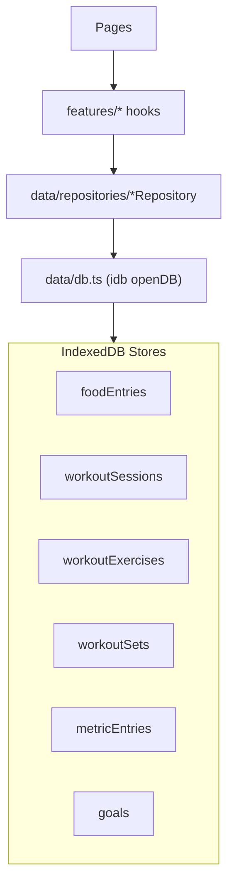

# IndexedDB Data Layer 확장 (Workouts / Metrics / Goals)

## 목표

- Meals에서 만든 구조를 그대로 확장해 **운동/지표/목표도 동일한 DB 레이어(IndexedDB + Repository + TanStack Query hooks)** 를 갖추게 합니다.
- Workouts는 **정규화(세션/종목/세트 각각 store)** 로 저장합니다.
- Metrics는 **하루 여러 개 기록 허용**(timestamp 기반 정렬/조회)으로 저장합니다.

## 현재 기준(이미 구현됨)

- DB 연결: [`src/data/db.ts`](src/data/db.ts) — `openDB`, `WeightAppDB`, `foodEntries` store
- Meals Repository: [`src/data/repositories/mealRepository.ts`](src/data/repositories/mealRepository.ts)
- Meals hooks: [`src/features/meals/*`](src/features/meals)

## 아키텍처(확장 후)

## 1) 도메인 타입 추가

- Workouts
  - [`src/domain/workouts/types.ts`](src/domain/workouts/types.ts)
  - 제안 타입(요지)
    - `WorkoutSession` (id, date, createdAt, updatedAt)
    - `WorkoutExercise` (id, sessionId, date, name, createdAt, updatedAt)
    - `WorkoutSet` (id, sessionId, exerciseId, date, setIndex, weight, reps, createdAt, updatedAt)
    - 각 입력용 `*Input` 타입

- Metrics(Progress)
  - [`src/domain/metrics/types.ts`](src/domain/metrics/types.ts)
  - 제안 타입(요지)
    - `MetricType` (예: weight, bodyFat 등)
    - `MetricEntry` (id, date, type, value, unit, createdAt, updatedAt)
    - **하루 다중 기록**을 위해 `createdAt`을 실제 기록 시각으로 사용

- Goals
  - [`src/domain/goals/types.ts`](src/domain/goals/types.ts)
  - 제안 타입(요지)
    - `Goals` (dailyCalories?, macroTargets?, weightGoal?, workoutGoal?, updatedAt)
    - 단일 레코드(예: id="default")로 관리

## 2) IndexedDB 스키마 확장 (DB_VERSION bump)

- 수정: [`src/data/db.ts`](src/data/db.ts)
  - **DB_VERSION: 1 → 2** (기존 사용자 DB에 새 store 생성되도록)
  - `WeightAppDB`에 store 추가:
    - `workoutSessions` (index: by-date)
    - `workoutExercises` (indexes: by-sessionId, by-date)
    - `workoutSets` (indexes: by-sessionId, by-exerciseId, by-date)
    - `metricEntries` (indexes: by-type, by-date, by-type-date, by-type-createdAt)
    - `goals`
  - `upgrade(db, oldVersion, newVersion, tx)`에서 **store가 없으면 생성**
    - idb 문서 참고: 트랜잭션 수명 주의(업그레이드/읽기-쓰기 트랜잭션 내에서 외부 await 금지)

## 3) Repository 추가 (IndexedDB 구현)

### 3-1. Workouts Repository

- 신규: [`src/data/repositories/workoutRepository.ts`](src/data/repositories/workoutRepository.ts)
- 인터페이스 + 구현(식단과 동일 패턴)
- 핵심 메서드(권장 최소)
  - `getByDate(date)` → 세션/종목/세트를 조합해 UI가 쓰기 쉬운 형태로 반환
  - `ensureSession(date)` → 날짜별 세션 upsert
  - `addExercise({ date, name })`
  - `deleteExercise({ date, exerciseId })` → 해당 종목의 세트 cascade delete
  - `addSet({ date, exerciseId, weight, reps })` → setIndex 자동 증가
  - `updateSet({ date, setId, input })`
  - `deleteSet({ date, setId })`
- 구현 포인트
  - `db.transaction(['workoutSessions','workoutExercises','workoutSets'], 'readwrite')`로 **원자적 갱신**
  - 조회는 `by-date`/`by-sessionId`/`by-exerciseId` 인덱스 기반으로 가져온 뒤 메모리에서 그룹핑

### 3-2. Metrics Repository

- 신규: [`src/data/repositories/metricRepository.ts`](src/data/repositories/metricRepository.ts)
- 핵심 메서드(권장 최소)
  - `listByType(type)` (정렬: date asc, createdAt asc)
  - `getLatestByType(type)`
  - `create(input)`
  - `update(id, input)`
  - `delete(id)`
- 구현 포인트
  - `by-type-createdAt` 인덱스로 “최신값” 조회 최적화 가능

### 3-3. Goals Repository

- 신규: [`src/data/repositories/goalRepository.ts`](src/data/repositories/goalRepository.ts)
- 핵심 메서드(권장 최소)
  - `get()`
  - `set(input)` (단일 레코드 upsert)
  - `clear()`

## 4) TanStack Query 키/훅 추가

### 4-1. Workouts feature

- 신규 폴더: [`src/features/workouts/`](src/features/workouts/)
  - `keys.ts` (`workoutKeys.all`, `workoutKeys.byDate(date)`, 필요시 `workoutKeys.sessions()`)
  - `queries.ts` (`useWorkoutByDate(date)`, 필요시 `useWorkoutSessionDates()`)
  - `mutations.ts`
    - addExercise/addSet/updateSet/deleteSet/deleteExercise
    - onSuccess에서 `queryClient.invalidateQueries({ queryKey: workoutKeys.byDate(date) })`

### 4-2. Metrics feature

- 신규 폴더: [`src/features/metrics/`](src/features/metrics/)
  - `keys.ts` (`metricKeys.byType(type)`, `metricKeys.latest(type)` 등)
  - `queries.ts` (`useMetricEntriesByType(type)`, `useLatestMetricByType(type)`)
  - `mutations.ts` (create/update/delete)

### 4-3. Goals feature

- 신규 폴더: [`src/features/goals/`](src/features/goals/)
  - `keys.ts` (`goalKeys.get()`)
  - `queries.ts` (`useGoals()`)
  - `mutations.ts` (`useSetGoals()`, `useClearGoals()`)

## 5) (검증용) 페이지에 최소 연동

- Workouts: [`src/pages/WorkoutsPage.tsx`](src/pages/WorkoutsPage.tsx)
  - 오늘 날짜 기준 `useWorkoutByDate(today)`로 렌더
  - 최소 UI: 종목 추가, 세트 추가(kg/reps), 세트 삭제 → invalidate로 즉시 갱신 확인

- Progress: [`src/pages/ProgressPage.tsx`](src/pages/ProgressPage.tsx)
  - 기본 지표 weight(kg) 입력 폼 + `useMetricEntriesByType('weight')` 리스트
  - 하루 다중 기록이므로 최신/전체를 UI에서 구분(최신값 표시 + 전체 리스트)

- Settings(Goals): [`src/pages/SettingsPage.tsx`](src/pages/SettingsPage.tsx)
  - Clerk `UserProfile`는 유지하되, 아래에 Goals 카드(예: dailyCalories 입력/저장)로 최소 검증
  - (더 깔끔하게 하려면) 추후 `/app/settings/goals` 같은 서브라우트로 분리

## 6) 마무리 체크

- 타입/린트 확인(새로 추가한 파일 중심)
- DB 업그레이드 확인(기존 foodEntries 데이터 유지 + 새 store 생성)
- 수동 테스트 시나리오
  - Workouts: “종목 1개 + 세트 1개 추가 → 새로고침 후에도 유지”
  - Metrics: 같은 날짜에 체중 2번 입력 → 리스트에 2개 존재
  - Goals: 목표 저장 → 새로고침 후에도 유지