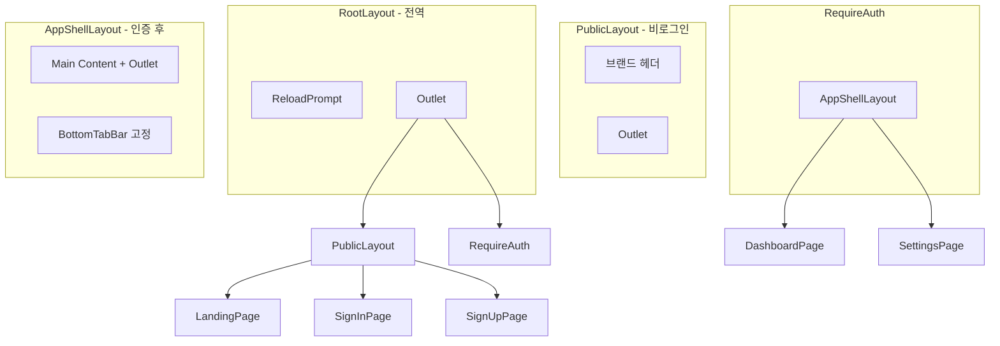

# 모바일 퍼스트 바텀탭 레이아웃 설계

## 레이아웃 구조



---

## 1. RootLayout 단순화

[`src/layouts/RootLayout.tsx`](src/layouts/RootLayout.tsx) - 전역 공통 요소만 담당

```tsx
export function RootLayout() {
  return (
    <>
      <ReloadPrompt />
      <Outlet />
    </>
  );
}
```

- 헤더/네비게이션 제거 (하위 레이아웃으로 이동)
- PWA 프롬프트, 전역 토스트/모달 등만 유지

---

## 2. PublicLayout 생성

[`src/layouts/PublicLayout.tsx`](src/layouts/PublicLayout.tsx) - 비로그인 영역용

```tsx
export function PublicLayout() {
  return (
    <div className="flex min-h-dvh flex-col">
      <header className="...">
        {/* 브랜드 로고, Sign in/up 링크 */}
      </header>
      <main className="flex-1">
        <Outlet />
      </main>
    </div>
  );
}
```

- Landing, SignIn, SignUp 페이지 감싸기
- 바텀탭 없음

---

## 3. AppShellLayout 생성 (기존 AppLayout 대체)

[`src/layouts/AppShellLayout.tsx`](src/layouts/AppShellLayout.tsx) - 인증 후 바텀탭 레이아웃

```tsx
export function AppShellLayout() {
  return (
    <div className="flex min-h-dvh flex-col">
      <main className="flex-1 overflow-y-auto pb-[calc(56px+env(safe-area-inset-bottom))]">
        <Outlet />
      </main>
      <BottomTabBar />
    </div>
  );
}
```

### BottomTabBar 컴포넌트

[`src/components/navigation/BottomTabBar.tsx`](src/components/navigation/BottomTabBar.tsx)

```tsx
const tabs = [
  { to: "/app/dashboard", icon: Home, label: "홈" },
  { to: "/app/history", icon: History, label: "기록" },
  { to: "/app/settings", icon: Settings, label: "설정" },
];

export function BottomTabBar() {
  return (
    <nav className="fixed inset-x-0 bottom-0 z-40 border-t bg-background pb-[env(safe-area-inset-bottom)]">
      <div className="flex h-14 items-center justify-around">
        {tabs.map((tab) => (
          <NavLink key={tab.to} to={tab.to} className={...}>
            <tab.icon />
            <span>{tab.label}</span>
          </NavLink>
        ))}
      </div>
    </nav>
  );
}
```

---

## 4. 라우팅 구조 변경

[`src/App.tsx`](src/App.tsx)

```tsx
<Routes>
  <Route element={<RootLayout />}>
    {/* Public 영역 */}
    <Route element={<PublicLayout />}>
      <Route index element={<LandingPage />} />
      <Route path="sign-in/*" element={<SignInPage />} />
      <Route path="sign-up/*" element={<SignUpPage />} />
    </Route>

    {/* Auth 영역 */}
    <Route element={<RequireAuth />}>
      <Route path="app" element={<AppShellLayout />}>
        <Route index element={<Navigate to="dashboard" replace />} />
        <Route path="dashboard" element={<DashboardPage />} />
        <Route path="settings/*" element={<SettingsPage />} />
      </Route>
    </Route>

    <Route path="*" element={<NotFoundPage />} />
  </Route>
</Routes>
```

---

## 5. iOS PWA Safe Area 대응

[`index.html`](index.html) - viewport-fit 추가

```html
<meta name="viewport" content="width=device-width, initial-scale=1.0, viewport-fit=cover" />
```

[`src/index.css`](src/index.css) - safe-area 유틸리티 (선택)

```css
@layer base {
  body {
    @apply font-sans bg-background text-foreground;
    /* iOS PWA 전체화면 대응 */
    padding-top: env(safe-area-inset-top);
  }
}
```

---

## 6. ReloadPrompt 위치 조정

[`src/components/pwa/ReloadPrompt.tsx`](src/components/pwa/ReloadPrompt.tsx)

바텀탭과 겹치지 않도록 위치 수정:

```tsx
<div className="fixed bottom-[calc(72px+env(safe-area-inset-bottom))] right-4 z-50 ...">
```

---

## 파일 변경 요약

| 파일 | 작업 |

|------|------|

| `src/layouts/RootLayout.tsx` | 헤더 제거, Outlet만 유지 |

| `src/layouts/PublicLayout.tsx` | 신규 생성 (비로그인 레이아웃) |

| `src/layouts/AppShellLayout.tsx` | 신규 생성 (바텀탭 레이아웃) |

| `src/layouts/AppLayout.tsx` | 삭제 또는 AppShellLayout으로 대체 |

| `src/components/navigation/BottomTabBar.tsx` | 신규 생성 |

| `src/App.tsx` | 라우팅 구조 변경 |

| `index.html` | viewport-fit=cover 추가 |

| `src/index.css` | safe-area 기본 패딩 (선택) |

| `src/components/pwa/ReloadPrompt.tsx` | 위치 조정 |