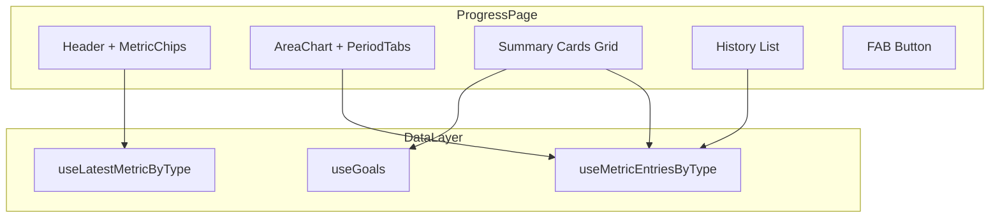

# Progress Page 개선 개발 계획

## 현재 상태

- 기본 지표 선택 (Select)과 기록 목록만 구현됨
- recharts 이미 설치됨, AreaChart 사용 패턴 존재 ([CaloriesHeroCard.tsx](src/pages/dashboard/CaloriesHeroCard.tsx))
- Goals에 `weightGoal` 필드 존재 ([types.ts](src/domain/goals/types.ts))

---

## Phase 1: 라인 차트 + 기간 선택

**목표**: 메트릭 데이터를 시각화하는 인터랙티브 차트 추가

**구현 내용**:

- 기간 선택 탭 (1W, 1M, 3M, 1Y, All)
- AreaChart with gradient fill (기존 CaloriesHeroCard 패턴 활용)
- 현재 값 + 변화량 표시 (예: 72.5 kg, -2.4 kg)
- 툴팁 인터랙션

**핵심 코드**:

```tsx
// 기간 필터링 로직
type Period = "1W" | "1M" | "3M" | "1Y" | "All";

function filterByPeriod(entries: MetricEntry[], period: Period) {
  const now = new Date();
  const daysMap = { "1W": 7, "1M": 30, "3M": 90, "1Y": 365, "All": Infinity };
  // 날짜 필터링...
}
```

**파일 변경**: [ProgressPage.tsx](src/pages/ProgressPage.tsx)

---

## Phase 2: Overview 요약 카드

**목표**: 목표 진행률과 통계 요약 카드 그리드 추가

**구현 내용**:

- Goal Weight 카드: 목표 체중, 남은 양, 진행률 프로그레스 바
- Total Change 카드: 총 변화량, 시작일 기준
- Current Metric 카드: 현재 값 + 지난달 대비 변화

**데이터 활용**:

- `useGoals()` - 목표 체중 가져오기
- `useMetricEntriesByType()` - 첫 기록/최신 기록으로 변화량 계산

**레이아웃**: 2열 그리드 (CSS Grid)

---

## Phase 3: Metric Chips UI 개선

**목표**: Select를 수평 스크롤 Chips로 교체

**구현 내용**:

- 수평 스크롤 가능한 Chip 버튼 그룹
- 선택된 Chip에 primary 스타일 적용
- 아이콘 추가 (lucide-react: Scale, Percent)

**컴포넌트 구조**:

```tsx
<div className="flex gap-2 overflow-x-auto no-scrollbar">
  <MetricChip active={type === "weight"} onClick={() => setType("weight")}>
    <ScaleIcon /> 체중
  </MetricChip>
  <MetricChip active={type === "bodyFat"} onClick={() => setType("bodyFat")}>
    <PercentIcon /> 체지방률
  </MetricChip>
</div>
```

---

## Phase 4: History 목록 개선

**목표**: 기록 목록 UX 향상

**구현 내용**:

- 날짜 그룹핑 (오늘, 어제, 날짜)
- 전일 대비 변화량 표시 (예: -0.3 kg)
- 아이콘 추가 (오늘/다른날 구분)
- "모두 보기" 버튼 (최근 5개만 기본 표시)

**변화량 계산 로직**:

```tsx
function getChangeFromPrevious(entries: MetricEntry[], index: number) {
  if (index >= entries.length - 1) return null;
  return entries[index].value - entries[index + 1].value;
}
```

---

## Phase 5: FAB 버튼 추가

**목표**: 빠른 기록 추가를 위한 Floating Action Button

**구현 내용**:

- 우하단 고정 버튼 (position: fixed)
- 클릭 시 기존 폼 오픈 트리거
- hover/active 애니메이션

**스타일**:

```tsx
<button className="fixed bottom-20 right-4 z-40 size-14 rounded-2xl bg-primary 
  text-primary-foreground shadow-lg flex items-center justify-center 
  hover:scale-105 active:scale-95 transition-all">
  <PlusIcon className="size-6" />
</button>
```

**주의**: BottomTabBar 높이(약 64px) 고려하여 bottom 위치 조정

---

## 아키텍처



---

## 파일 구조 (최종)

```
src/pages/
  ProgressPage.tsx          # 메인 페이지 (리팩토링)
  progress/
    MetricChips.tsx         # Phase 3
    MetricChart.tsx         # Phase 1
    OverviewCards.tsx       # Phase 2
    HistoryList.tsx         # Phase 4
```