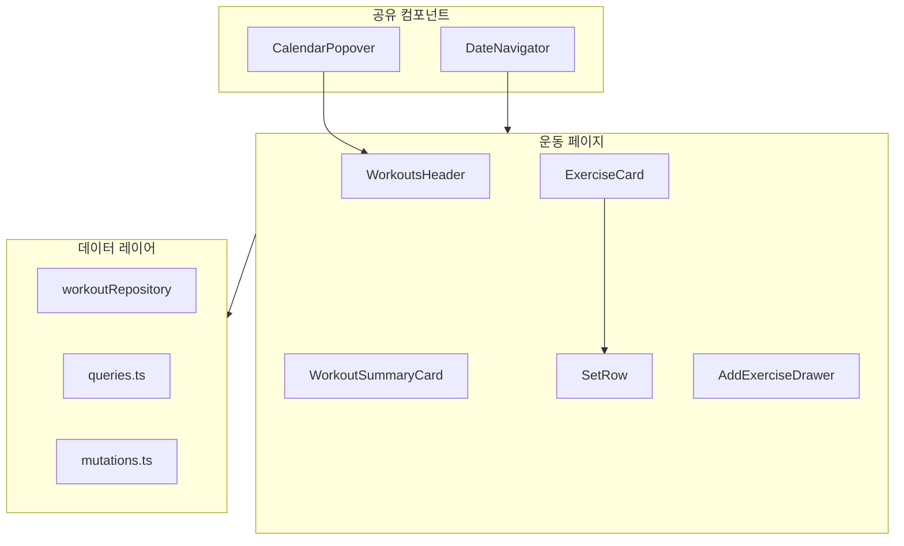

# Workouts Page Phase 1+2 구현 계획

## 아키텍처 개요



---

## Phase 1: 구조 개선

### 1. 공유 컴포넌트 추출

[`src/pages/meals/DateNavigator.tsx`](src/pages/meals/DateNavigator.tsx)와 [`src/pages/meals/CalendarPopover.tsx`](src/pages/meals/CalendarPopover.tsx)를 공유 컴포넌트로 이동:

```
src/components/date-navigation/
├── index.ts
├── DateNavigator.tsx
└── CalendarPopover.tsx
```

- meals 페이지 import 경로 업데이트

### 2. 폴더 구조 생성

```
src/pages/workouts/
├── index.ts
├── WorkoutsPage.tsx      # 메인 컨테이너
├── WorkoutsHeader.tsx    # 헤더 (제목, 날짜, 캘린더)
├── WorkoutSummaryCard.tsx # 일일 통계 카드
├── ExerciseCard.tsx      # 운동 카드 (세트 그리드 포함)
├── SetRow.tsx            # 개별 세트 행
└── AddExerciseDrawer.tsx # 운동 추가 드로어
```

### 3. WorkoutsHeader 구현

```tsx
// 프로토타입 참고: 제목 + 날짜 + 캘린더 버튼
<header>
  <h1>운동</h1>
  <p>{dateLabel}</p>  {/* "오늘" 또는 "12월 16일" */}
  <CalendarPopover>...</CalendarPopover>
</header>
```

### 4. 세트 그리드 레이아웃 (SetRow)

프로토타입의 5컬럼 그리드 구현:

```tsx
// grid-cols-[1.5rem_1fr_1fr_1fr_2rem]
| Set | Prev | kg | Reps | ✓ |
```

---

## Phase 2: UX 향상

### 5. 이전 기록 표시

**데이터 레이어 추가:**

[`src/features/workouts/queries.ts`](src/features/workouts/queries.ts)에 추가:

```tsx
// 같은 운동명의 가장 최근 세트 조회
export function usePreviousExerciseSets(exerciseName: string, currentDate: string)
```

[`src/data/repositories/workoutRepository.ts`](src/data/repositories/workoutRepository.ts)에 추가:

```tsx
// 특정 운동명의 이전 날짜 세트 목록 조회
getPreviousSetsForExercise(name: string, beforeDate: string): Promise<WorkoutSet[]>
```

### 6. 세트 완료 토글

**스키마 변경:** [`src/domain/workouts/types.ts`](src/domain/workouts/types.ts)

```tsx
interface WorkoutSet {
  // ... 기존 필드
  completed?: boolean;  // 새 필드 추가
}
```

**UI:** SetRow에 체크 버튼 추가 - 완료 시 행 스타일 변경 (녹색 배경/테두리)

### 7. 인라인 세트 입력

- 기존: 별도 폼에서 입력
- 변경: SetRow 내 input에서 직접 입력 후 체크 버튼으로 저장
- 빈 세트 행 추가 시 자동 포커스

### 8. 로딩 스켈레톤

[`src/pages/meals/MealsPage.tsx`](src/pages/meals/MealsPage.tsx) 패턴 참고:

```tsx
if (isLoading) {
  return (
    <div className="space-y-4">
      <div className="h-10 animate-pulse rounded bg-muted" />
      <div className="h-14 animate-pulse rounded bg-muted" />
      {/* ... */}
    </div>
  );
}
```

---

## 라우팅 업데이트

[`src/App.tsx`](src/App.tsx) 수정:

```tsx
import { WorkoutsPage } from "@/pages/workouts";
// 기존: import { WorkoutsPage } from "@/pages/WorkoutsPage";
```

---

## 구현 순서

1. 공유 컴포넌트 추출 및 meals import 업데이트
2. workouts 폴더 구조 생성 + index.ts
3. WorkoutsPage 기본 골격 (날짜 상태, 데이터 쿼리)
4. WorkoutsHeader + DateNavigator 연동
5. WorkoutSummaryCard (총 세트, 볼륨)
6. ExerciseCard + SetRow (그리드 레이아웃)
7. 이전 기록 쿼리 추가 및 Prev 컬럼 표시
8. 세트 완료 토글 (타입 확장 + UI)
9. 인라인 입력 + 세트 추가
10. AddExerciseDrawer
11. 로딩 스켈레톤
12. App.tsx 라우팅 업데이트